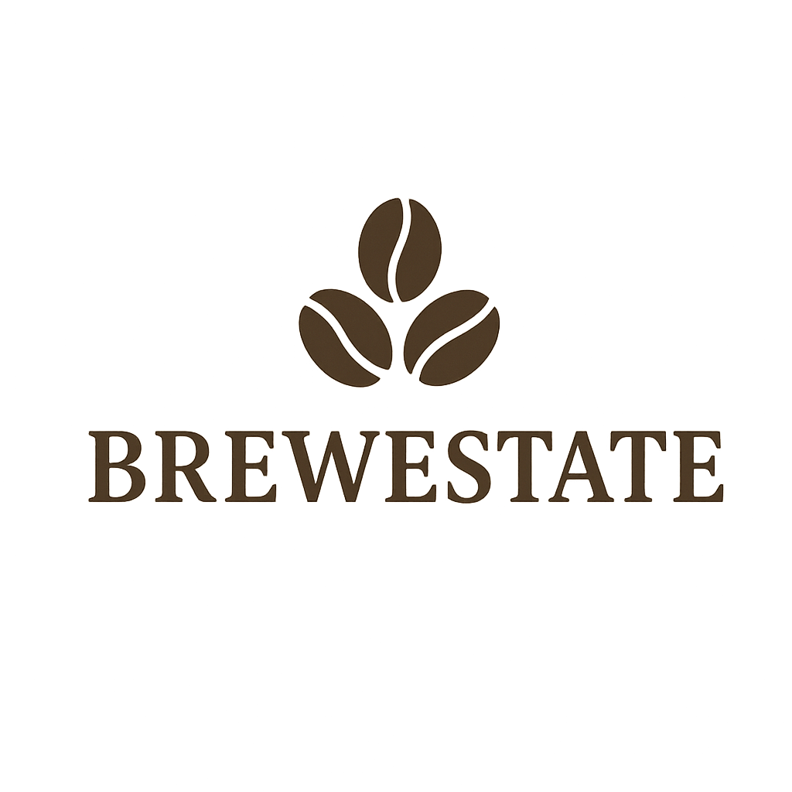
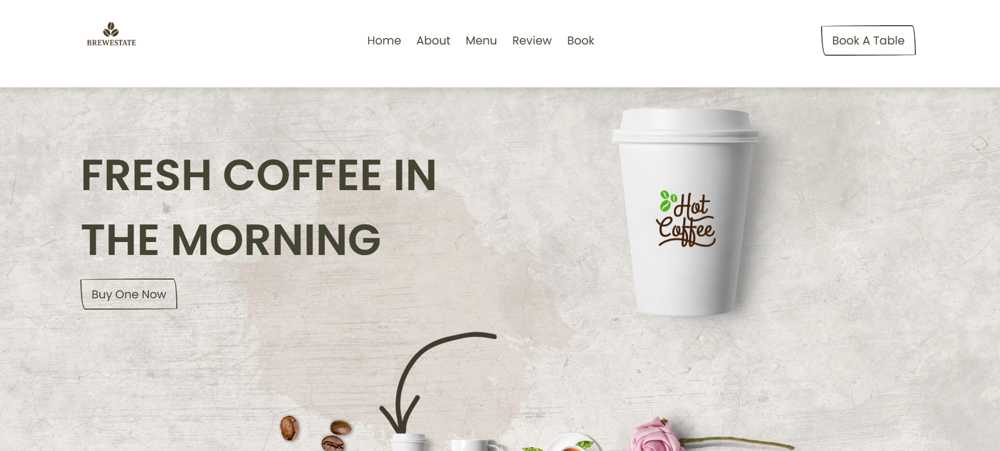
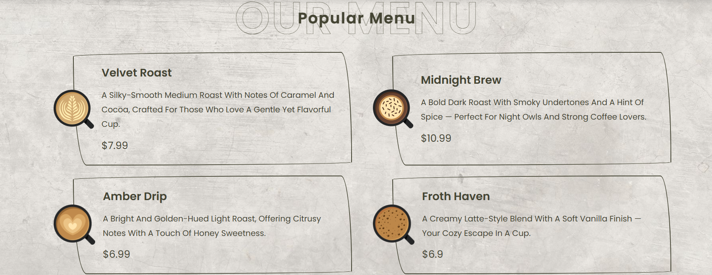

# BREWESTATE — Coffee Shop Website

A modern, cozy, and brand-forward coffee shop website for **Brewestate**.  
This project highlights our unique blends, warm ambiance, and simple online actions like viewing the menu and booking a table.

---

## Preview

<!-- Keep images in this order: Logo → Home → Menu -->

---

## About the Project

Brewestate is built to feel welcoming and premium. The design focuses on clear typography, subtle textures, and coffee-forward visuals. Visitors can quickly learn about the brand, explore popular coffees, read reviews, and book a table.

### What Makes Our Coffee Special
We carefully source premium beans from ethical farms and roast them in small batches to preserve their rich aroma and flavor. Each blend is crafted with balance—smooth textures, bold notes, and a warm finish—served by baristas who treat every cup like an experience.

---

## Features

- **Brand-first header** with the Brewestate logo  
- **Hero section** with strong headline and call-to-action  
- **Popular Menu** with unique signature coffees and prices  
- **Reviews/Testimonials** for social proof  
- **Book a Table** button for quick action  
- **Responsive layout** that looks great on mobile and desktop  

---

## Signature Menu Highlights

- **Velvet Roast** — Silky-smooth medium roast with caramel and cocoa notes.  
- **Midnight Brew** — Bold dark roast with smoky undertones and a hint of spice.  
- **Amber Drip** — Bright, golden light roast with citrus and honey sweetness.  
- **Froth Haven** — Creamy latte-style blend with a soft vanilla finish.  

*(Prices and descriptions can be edited in the menu section of your HTML.)*

---

## Tech Stack

- **HTML5** & **CSS3** (with Font Awesome icons)  
- **Vanilla JavaScript** for interactivity  
---

## Getting Started

1. **Clone or download** the project files.  
2. Place your images in the `assets/` folder:  
   - `assets/logo.png`  
   - `assets/Homepage.png`  
   - `assets/menu.png`  
3. Open `index.html` in your browser.  

---

## Customize

- **Logo size**: adjust CSS for `.logo img { height: ... }`  
- **Menu items**: edit the menu cards’ titles, descriptions, and prices in `index.html`  
- **Colors/Fonts**: tweak variables or classes in your main CSS file  
- **Icons**: use Font Awesome (e.g., `fa-map-marker-alt` for locations)  

---

## Locations

- Bengaluru, India  
*(Add more branches by duplicating the location line in your contact/footer section.)*

---
